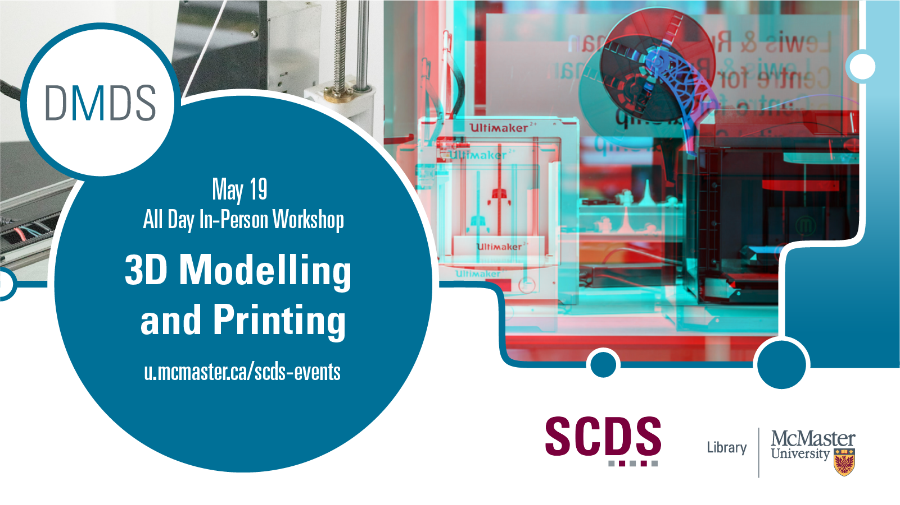

## 3D Modelling and Printing

This was a day-long workshop that explored 3d modelling and printing. The group took a physical object from the real world, used a series of sophisticated software to render it into a 3d model, and then learned how to print that model on a 3d printer.

Presentation by John Fink, Digital Scholarship Librarian, and Britt Sostar, Thode Makerspace Coordinator.
[Book an appointment with John or another member of the Sherman Centre Team.](https://libcal.mcmaster.ca/appointments/)

## Workshop slides

<iframe src="//docs.google.com/viewer?url=https://github.com/scds/dmds-22-23/raw/main/assets/docs/PGSlides.pdf?dl=0&hl=en_US&embedded=true" class="gde-frame" style="position:absolute;top:0;left:0;width:100%;height:100%;border:none;" scrolling="no"></iframe>

<iframe src="//docs.google.com/viewer?url=https://github.com/scds/dmds-22-23/raw/main/assets/docs/3DPSlides.pdf?dl=0&hl=en_US&embedded=true" class="gde-frame" style="position:absolute;top:0;left:0;width:100%;height:100%;border:none;" scrolling="no"></iframe>

