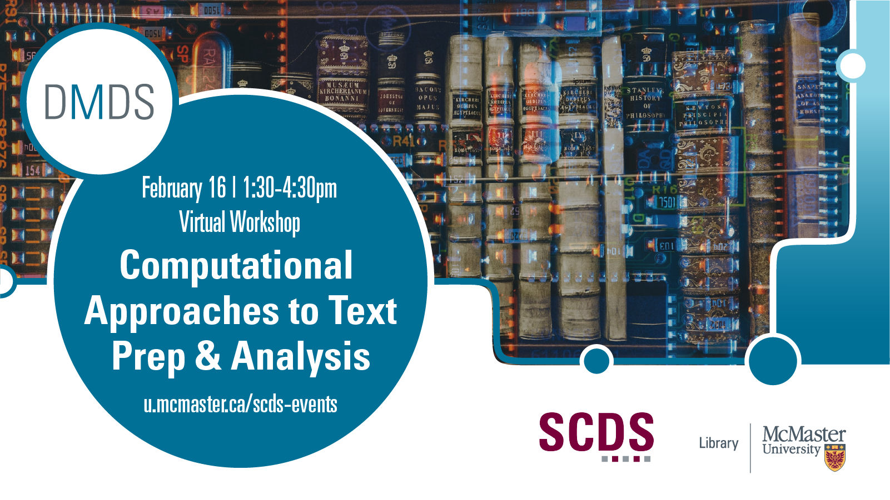

## Computational Approaches to Text Preparation and Analysis

Are you interested in textual analysis but unsure about where to start? Join us for an interactive “no experience required” introduction to the fundamental concepts, processes, and methodological approaches for preparing and analyzing text using computational approaches. Following a general introduction to the topic, participants will be guided through prepared exercises that demonstrate how different software packages (OpenRefine, Python) can be used to prepare for and perform textual analysis.

Presented by Jay Brodeur (Associate Director, Digital Scholarship Infrastructure & Services and Administrative Director of the Sherman Centre for Digital Scholarship) and Devon Mordell (Educational Developer, The MacPherson Institute for Teaching and Learning).

## Preparation

For this workshop, you will need [OpenRefine](https://openrefine.org/) and a web browser. Follow the [instructions](https://librarycarpentry.org/lc-open-refine/setup.html) provided by the Library Carpentry to install OpenRefine on your system (whether it is Windows, Mac, or Linux).
- **NOTE**: When opening OpenRefine for the first time in a Mac, you may need to open your security preferences and permit OpenRefine to run. See [this article](https://support.apple.com/guide/mac-help/open-a-mac-app-from-an-unidentified-developer-mh40616/mac) from Apple Support about opening a Mac app from an unidentified developer.

## Contents

|Segment|Time Allotted|Key Topics / Activities|
|:--|:--|:--|
|**Introductory remarks**|20 minutes|Introduction to text preparation and analysis   Overview of concepts and methods   Key considerations for different source materials and analyses|
|**OpenRefine**|40 minutes|Introduction to OpenRefine   Manual cleanup (e.g. find and replace)   Faceting|
|**Getting Programmatic with Python** |20 minutes|Overview of programmatic approaches   The 'what' and 'when' to program   Using Python for text preparation   [Link to notebook](https://u.mcmaster.ca/dmds-text-prep)|
|**Break**|10 minutes|**Break**|
|**Sampling of text analysis methods**|75 minutes|Named entity recognition ([Link to notebook](https://u.mcmaster.ca/dmds-ner))  Topic Modeling ([Link to notebook](https://u.mcmaster.ca/dmds-topics))  Sentiment analysis ([Link to notebook](https://u.mcmaster.ca/dmds-sentimental))|
|**Q & A; Final Thoughts**|10 minutes|Questions and wrap-up   Where to learn more |

## Workshop notebooks
Most of our work will be done using jupyter notebooks hosted in Google Colab.
- [Introduction to programmatic text prep](https://u.mcmaster.ca/dmds-text-prep)
- [Named entity recognition (NER)](https://u.mcmaster.ca/dmds-ner)
- [Topic modeling](https://u.mcmaster.ca/dmds-text-prep)
- [Sentiment analysis](https://u.mcmaster.ca/sentimental)

## Workshop recording
*Coming soon* 

<!--
<iframe height="480" width="853" allowfullscreen frameborder=0 src="https://echo360.ca/media/1b50bff1-4c60-4c36-87c7-f1e5140dffc7/public"></iframe>

View the original [here](https://echo360.ca/media/1b50bff1-4c60-4c36-87c7-f1e5140dffc7/public). 
-->

## Workshop slides
*Coming soon*

<!--

<iframe src="//docs.google.com/viewer?url=https://github.com/scds/dmds-22-23/raw/main/assets/docs/Voyant Presentation.pdf?dl=0&hl=en_US&embedded=true" class="gde-frame" style="position:absolute;top:0;left:0;width:100%;height:100%;border:none;" scrolling="no"></iframe>

-->

## Learn more
Here are a variety of helpful resources to explore and learn more

### OpenRefine
- [Library Carpentry lesson on OpenRefine](https://librarycarpentry.github.io/lc-open-refine/setup.html)
- [University of Toronto Libraries OpenRefine tutorials](https://mdl.library.utoronto.ca/tools/openrefine)
- [OpenRefine Manual on Regular Expressions](https://docs.openrefine.org/manual/expressions#regular-expressions)
- [Using regular expressions in OpenRefine](https://gist.github.com/pmgreen/6e133c5dcde65762d29c): Tutorial by Peter Green, includes non-Latin script.
- Regular expression testers
	- [https://www.regular-expressions.info/](https://www.regular-expressions.info/)
	- [https://regex101.com/](https://regex101.com/)
	- [Regexr](https://regexr.com/): Interactive regular expression (regex) coder and explainer

### Python & NLP

#### Python Integrated Development Environments
- There are many, many different Python IDEs. Find which one is [best for you](https://realpython.com/python-ides-code-editors-guide/). Jay is partial to [Pyzo](https://pyzo.org/).

#### Python packages for text prep and Natural Langauge Processing
- [PyTesseract](https://stackabuse.com/pytesseract-simple-python-optical-character-recognition): Simple Python Optical Character Recognition
- [spaCy](https://spacy.io/usage/spacy-101/) NLP library and documentation
- [NLTK](https://www.nltk.org/) NLP library and docmentation
- [natas](https://pypi.org/project/natas/): Library for  processing historical English corpora, especially for studying neologisms
- [Python phonetics package](https://pypi.org/project/phonetics/#usage), which includes methods for matching and clustering words by phonetic similarity
- [pyspellchecker](https://pyspellchecker.readthedocs.io/en/latest/): A simple Python-based spell checking algorithm

#### Other tutorials and resources
- [Constellate](https://constellate.org/) a comprehensive set of resources to learn how to build your text and data mining skills. 
- [How to Clean Text for Machine Learning with Python](https://machinelearningmastery.com/clean-text-machine-learning-python/). An excellent step-by-step walkthrough of the fundamentals of text prep with Python.
- [Python Regex (Regular Expressions) for Data Scientists](https://www.dataquest.io/blog/regular-expressions-data-scientists/)
- [Cleaning OCR’d text with Regular Expressions](https://programminghistorian.org/en/lessons/cleaning-ocrd-text-with-regular-expressions) by Laura Turner O'Hara for The Programming Historian.
- [Natural Language Processing With Python's NLTK Package](https://realpython.com/nltk-nlp-python/#getting-text-to-analyze): An excellent end-to-end tutorial using the nltk package
- [Natural Language Processing with Python: Introduction](https://sanjayasubedi.com.np/nlp/nlp-intro/). This is an excellent step-by-step introduction to basic pre-processing steps (though no clustering or error find/replace)
- [Using Binder to connect GitHub repositories to Jupyter Notebooks](https://github.com/alan-turing-institute/the-turing-way/blob/master/workshops/boost-research-reproducibility-binder/workshop-presentations/zero-to-binder-python.md#1-creating-a-repo-to-binderize)
