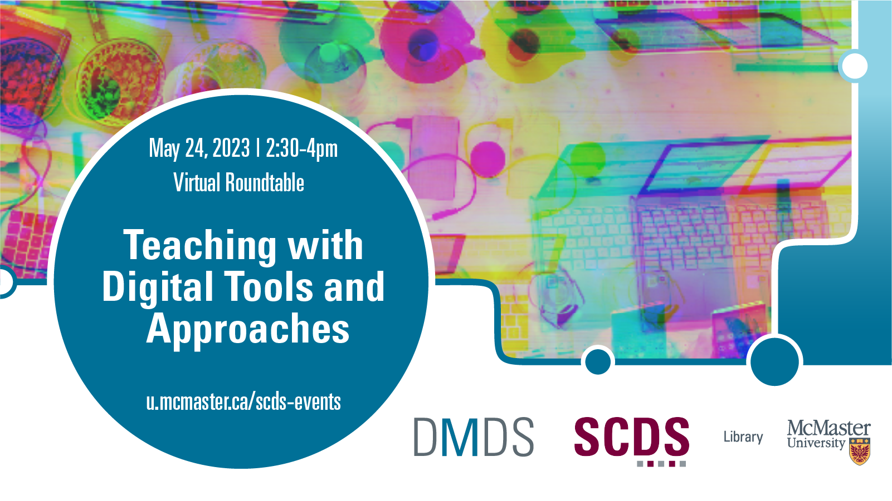

## Teaching with Digital Tools and Approaches: A Sherman Centre Roundtable

From podcasts and video games to coding and data visualizations, digital tools are on the rise in the university classroom—and for good reason. When integrated well, these approaches can facilitate student-centered learning, critical literacy skills, interdisciplinary inquiry, collaboration, and more. Learn how you can integrate digital tools and approaches into your curriculum at this relaxed roundtable conversation with members of the Sherman Centre team.

This session features four short presentations:
- Jay Brodeur (Associate Director of Digital Scholarship Services) will show attendees how Jupyter Notebooks (a web platform for interactive code development and data analysis) can develop digital literacy.
- Danica Evering (Research Data Management Specialist) will discuss how teachers can prepare graduate students for the increasingly prominent field of Research Data Management.
- Veronica Litt (Digital Scholarship Coordinator) will provide a blueprint for teachers who want to integrate creative digital assignments, such as podcasts and DIY video games, into undergraduate courses.
- Subhanya Sivajothy (Data Analysis and Visualization Librarian) will focus on how the exciting field of data visualization fosters student-centred learning and critical data literacy skills.

[Book an appointment with these presenters or another member of the Sherman Centre Team.](https://libcal.mcmaster.ca/appointments/)

## Workshop recording

Coming Soon

## Workshop slides

Coming Soon

## Links

*Prefatory Material*
- [The Sherman Centre for Digital Scholarship](https://scds.ca/)
- [Native Land] (https://native-land.ca/)
- [Code of Conduct for SCDS Events] (https://scds.ca/events/code-of-conduct/)
- [Certificate Program](https://scds.ca/certificate-program/)
- [Book a Research Consultation] (https://scds.ca/research-consultations/)
- Access the [MENTI](https://www.menti.com/blhkfrkj9sfo)

*Subhanya Sivajothy’s Presentation Links:*
- [Catalogue of different visualizations](https://datavizcatalogue.com/)
- [Research Guide to Data Visualizations] (https://libguides.mcmaster.ca/dataviz)
- [Book an appointment with Subhanya] (https://libcal.mcmaster.ca/appointments/dataviz)
- [Download Gephi] (https://gephi.org/users/download/)

*Jay Brodeur’s Presentation Links:*
- [List of existing Jupyter kernels](https://github.com/jupyter/jupyter/wiki/Jupyter-kernels)
- [Jupyter notebook example From constellate.org’s learning resources](https://u.mcmaster.ca/jupyter-example)
- [Jupyter Notebook user manual](https://jupyter-notebook.readthedocs.io/en/stable/notebook.html)
- [Installing Jupyter Notebooks](https://jupyter.org/install)
- [Jupyterlite hosted notebook](https://jupyter.org/try)
- [Google Colab notebooks](https://research.google.com/colaboratory)
- [Syzygy (Compute-Canada Jupyter Notebook platform available to researchers across Canada)](https://syzygy.ca/) 
- [Constellate](https://constellate.org/) Jupyter Notebook-based modules and computing platform
- Learning resources are available for open use through its [GitHub repository]( https://github.com/ithaka/constellate-notebooks) 	
- The [Constellate computing platform]( https://constellate.org/login) will soon be available to all McMaster users https://constellate.org/.
- [Binder]( https://mybinder.org/): A web-based hosting service for Jupyter Notebooks hosted in GitHub repositories.

*Veronica Litt’s Presentation Links:*
- [Learn about HUM2DH3: Creative, Collaborative, Critical: Introduction to Digital Scholarship](https://scds.ca/events/courses/2022-2023/)
- [Podcasting in 6 Simple Steps - Learning Module] (https://scds.github.io/podcasting/)
- [Audio Editing with Audacity Video Tutorials] (https://scds.github.io/podcasting/2dh3.html)  
- [Download Audacity] (https://www.audacityteam.org/download/)
- [Twine Games - Learning Module] (https://scds.github.io/dmds-22-23/Twine.html) 
- [Book a consultation with Veronica](https://libcal.mcmaster.ca/appointments)

*Danica Evering’s Presentation Links:*
- [Data Management Planning](http://rdm.mcmaster.ca/plan)
- [DMP Assistant](https://assistant.portagenetwork.ca/) 
- [Tri-Agency Research Data Management Policy]( https://science.gc.ca/site/science/en/interagency-research-funding/policies-and-guidelines/research-data-management/tri-agency-research-data-management-policy)
- [NIH Data Management and Sharing Policy]( https://sharing.nih.gov/data-management-and-sharing-policy)

*Jay Brodeur’s Case Study Link:*
- [Teaching and Learning with Jupyter](https://jupyter4edu.github.io/jupyter-edu-book/)

*Danica Evering’s Case Study Links:*
- [Data Management Plans As a Research Tool (DART)](https://osf.io/jj7dm)
- [Digital Research Alliance of Canada – DMP Examples](https://alliancecan.ca/en/services/research-data-management/learning-and-training/training-resources)
- [Cynthia Hudson-Vitale and Heather Moulaison-Sandy, “Data Management Plans: A Review,” DESIDOC Journal of Library and Information Technology 39, no. 6 (December 18, 2019): 322–28, https://doi.org/10.14429/djlit.39.6.15086.](https://doi.org/10.14429/djlit.39.6.15086)
- [“DataWorks! Data Management Plan (DMP) Challenge Evaluation Rubric,” Federation of American Societies for Experimental Biology (FASEB), 2023, https://www.faseb.org/getmedia/cb681545-2ed5-4970-b167-e1b47b1f225e/Rubric-for-DataWorks-DMP-Challenge-12-14-21.pdf](https://www.faseb.org/getmedia/cb681545-2ed5-4970-b167-e1b47b1f225e/Rubric-for-DataWorks-DMP-Challenge-12-14-21.pdf)
- [Maria Praetzellis, “DMP Competition Winners: DMPs so good they go to 11,” Qualitative Data Repository, DMP Tool, Princeton Research Data Service, May 19, 2021, https://blog.dmptool.org/2021/05/19/dmp-competition-winners-dmps-so-good-they-go-to-11/](https://blog.dmptool.org/2021/05/19/dmp-competition-winners-dmps-so-good-they-go-to-11/)

*Stay in Touch:*
- [Browse 85+ resources in our Online Learning Catalogue](https://scds.ca/searchable-online-learning/)
- [Book a Research or Teaching Consultation with the Sherman Centre Team](https://scds.ca/research-consultations/)
- [Email and Hours](https://scds.ca/email-hours/)
- [Sign up for our mailing list](https://scds.us20.list-manage.com/subscribe?u=c9e73948388e85178c813779a&id=b80e29c261)

