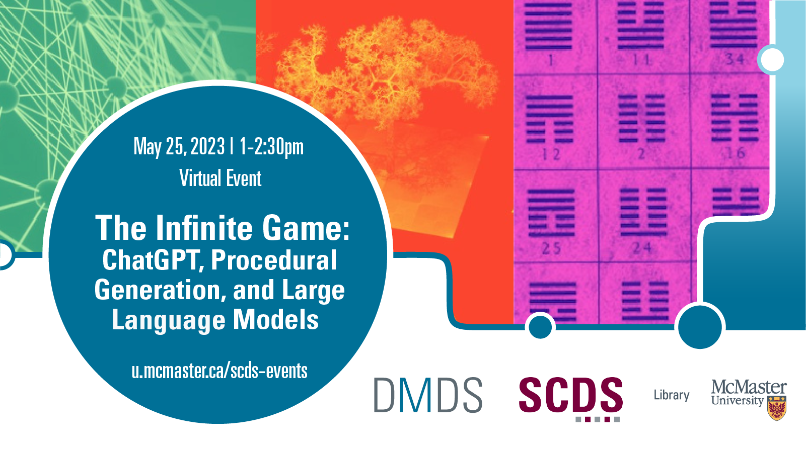

# The Infinite Game: ChatGPT, Procedural Generation, and Large Language Models

Since launching in late 2022, ChatGPT has sparked an ongoing, complex conversation about large language models and artificial intelligence. But where does this cutting-edge technology come from? What are its roots--and how can they help us understand today's software?

This webinar by John Fink (Digital Scholarship Librarian) explores the history of procedural generation in text and games, from the I-Ching to ChatGPT and beyond. The talk will emphasize current state of the art Large Language Models like ChatGPT, including a demonstration on how to run one on a modest computer and get near-ChatGPT quality output. 

[Book an appointment with John Fink or another member of the Sherman Centre Team.](https://libcal.mcmaster.ca/appointments/)

## Workshop Recording

<iframe height="416" width="100%" allowfullscreen frameborder=0 src="https://echo360.ca/media/67275d90-9ef9-4d11-84db-efb88dfafbdd/public"></iframe>

[View the original here.](https://echo360.ca/media/67275d90-9ef9-4d11-84db-efb88dfafbdd/public)

## Workshop Slides
<embed src="assets/docs/IGSlides.pdf" style="border:none;" width="100%" height="466px">

[Download as PDF.](assets/docs/IGSlides.pdf)

## Links and Resources

- [Browse John Fink's materials on GitHub](https://github.com/jbfink/20230525-infinite-game)
- [Browse links mentioned in the talk](https://github.com/jbfink/20230525-infinite-game/blob/main/links.txt)

