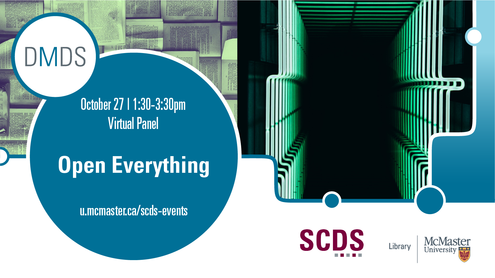

## Open Everything! A Panel on the Whats, Hows, and Ifs of Open Scholarship

The shift towards 'openness' has been undeniable and accelerating within the academic landscape over the past decade. From open-source software, to open data, methods, and identifiers, to open access publishing and educational resources, more and more of the scholarly ecosystem can be discovered, reused, remixed, and connected in novel ways. Join us for this panel discussion, where we explain and connect the components of open scholarship while reflecting on the gaps, limitations, and disclaimers of an 'open everything.'

Hosted by Jay Brodeur, Associate Director of Digital Scholarship Services and Administrative Director of the Sherman Centre for Digital Scholarship, this event brings together panelists to introduce and discuss a many facets of open scholarship. Panelists include: 

- Jeffrey Demaine, Bibliometrics and Research Impact Librarian, McMaster University Library. Topic: Open Identifiers.
- Danica Evering, Research Data Management Specialist, McMaster University Library and Research and High Performance Computing Support (RHPCS). Topic: Open Data.
- John Fink, Digital Scholarship Librarian, McMaster University Library. Topic: Open Source Software.
- Joanne Kehoe, Lead Educational Developer, Paul R. MacPherson Institute for Leadership, Innovation and Excellence in Teaching. Topic: Open Educational Resources (OERs). 
- Isaac Pratt, Research Data Management Specialist, McMaster University Library and Research and High Performance Computing Support (RHPCS). Topic: Open Methods.
- Jay Brodeur, Associate Director, Digital Scholarship Services, McMaster University Library. Topic: Open Access (OA).

## Workshop recording

<iframe height="480" width="853" allowfullscreen frameborder=0 src="https://echo360.ca/media/5d1b85c6-9698-4109-8811-e71da72b591b/public"></iframe>

View the original [here](https://echo360.ca/media/5d1b85c6-9698-4109-8811-e71da72b591b/public). 
