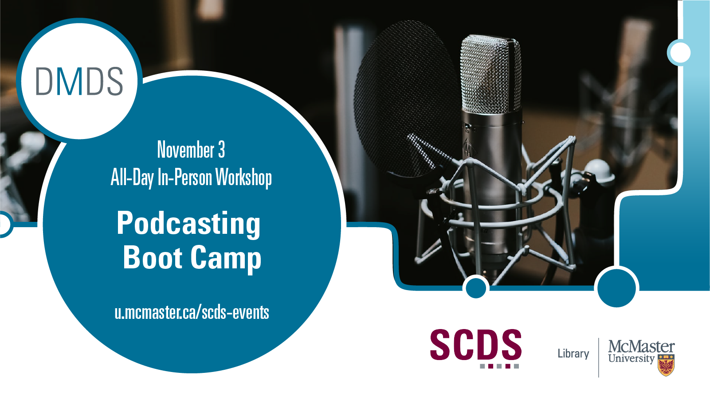

## Podcasting Boot Camp

Podcasts can take academic research out of the ivory tower and into the public. This intensive day-long boot camp was for academics and researchers who are interested in creating a podcast about their work. We discussed how to plan a show, best practices for recording crisp, professional audio, and gave participants hands-on experience with editing on Audacity, a free and open source audio editing software. We also discussed how to brand your show, go through the basics of hosting and distribution, then discussed how to promote your podcast and build an audience.

This workshop was presented by Veronica Litt (Digital Scholarship Coordinator) and Elaine Westenhoefer (Digital Media Specialist). 

## Workshop materials

Because this workshop was not recorded, we have created a [detailed online module](https://scds.github.io/podcasting/) including video tutorials. 

If you have questions about podcasting, please contact Veronica Litt at littvs@mcmaster.ca and Elaine Westenhoefer at westenev@mcmaster.ca 
