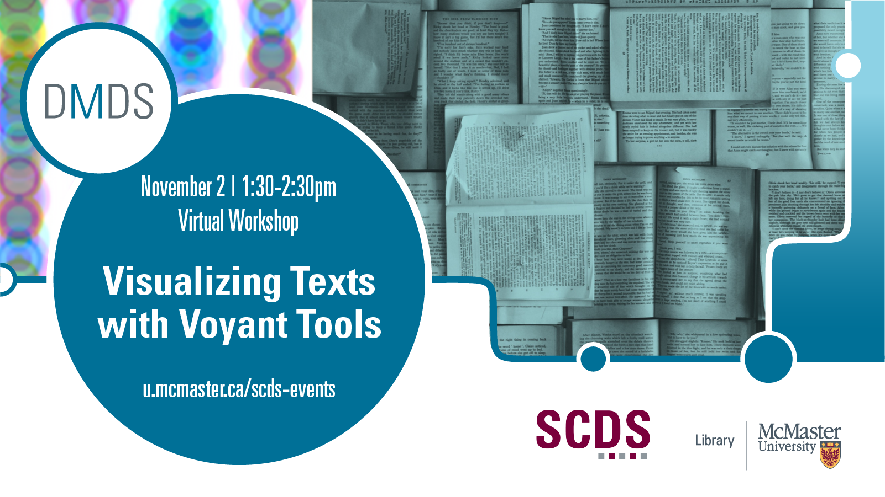

## Visualizing Texts with Voyant Tools

Voyant Tools is a web-based text reading and analysis environment. Essentially, it is a toolkit that aims to make text analysis accessible. In this workshop, you will learn to use the web-based application Voyant Tools to analyze and visualize the text content of documents.

Presentation by Subhanya Sivajothy, Data Analysis and Visualization Librarian. 
Feel free to contact Subhanya about data visualization and textual analysis by emailing her at sivajos@mcmaster.ca 

## Access Voyant
You can use Voyant on your [browser](https://voyant-tools.org/).

## Workshop recording
Coming Soon

## Workshop slides
Coming Soon
